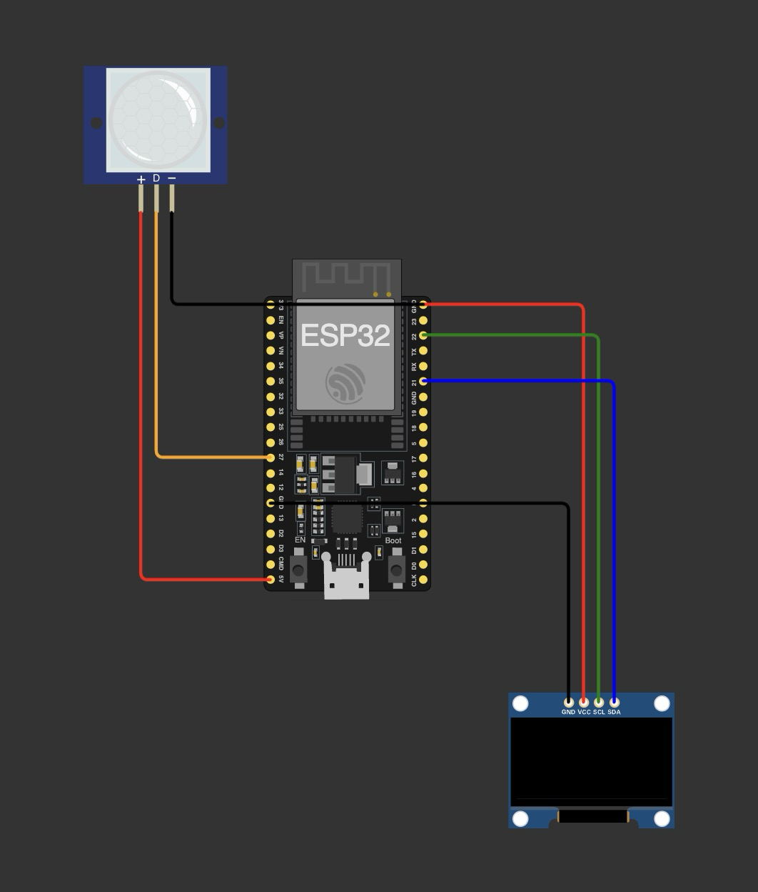

# Gargamel AI

MicroPython face animations for an ESP32 with a 128x64 SSD1306 OLED display.
The device shows animated expressions, reacts to a PIR presence sensor, and can
switch to a weather screen that fetches current conditions from `wttr.in`.

## Requirements

- A MicroPython-compatible board with I2C support
- SSD1306 OLED display wired to `scl=Pin(22)` and `sda=Pin(21)`
- HC-SR501 PIR sensor output wired to `GPIO27`
- Built-in BOOT button for switching screens
- WiFi access for the weather screen
- [`uv`](https://docs.astral.sh/uv/) for Python tool management
- USB serial access to the board

Install the host-side tooling:

```sh
uv sync
```

## Running on a Device

The Makefile uses `mpremote` through `uv run`. By default it connects to
`/dev/cu.usbserial-0001`; override this with `PORT` when needed.

```sh
make help
make run
PORT=/dev/cu.your-device make run
```

Useful device commands:

```sh
make deploy  # copy all .py files to the board
make repl    # open a MicroPython REPL
make ls      # list files on the board
make reset   # soft-reset the board
```

## Hardware Pins

The current pin layout is:

```text
OLED SCL -> GPIO22
OLED SDA -> GPIO21
PIR OUT  -> GPIO27
BOOT     -> GPIO0
```

Use a shared ground rail for the ESP32, OLED, and PIR sensor. Screen switching
uses the board's built-in BOOT button on `GPIO0`, configured with
`Pin.PULL_UP`; pressed reads as low. Do not hold BOOT while plugging in or
resetting the board, because that can enter firmware flashing mode.



## Weather Setup

The weather screen fetches current conditions from `wttr.in` over WiFi using a
compact text format. Create a local `config.py` from the example:

```sh
cp config.example.py config.py
```

Then set:

```python
WIFI_SSID = "your-wifi-name"
WIFI_PASSWORD = "your-wifi-password"
WTTR_LOCATION = "Santo Domingo"
```

`WTTR_LOCATION` can be a city, airport code, or coordinates. Leave it empty to
let `wttr.in` infer the location from the public IP address. The app requests
metric units, refreshes weather data every 10 minutes, and shows description,
temperature, feels-like temperature, and humidity.

Deploy both the app files and your local config to the board:

```sh
make deploy
```

## Project Layout

- `main.py`: initializes I2C, creates the OLED display, and plays animations.
- `wifi.py`: connects the ESP32 to WiFi and handles connection failures.
- `weather.py`: fetches and caches current weather from `wttr.in`.
- `face.py`: defines the reusable `Face` class.
- `faces.py`: composes named expressions such as `neutral`, `winky`, and `scary`.
- `eyes.py`: stores eye bitmap byte arrays and `framebuf.FrameBuffer` objects.
- `config.example.py`: template for WiFi credentials and `wttr.in` location.
- `Makefile`: wraps common `mpremote` workflows.

## Development Notes

Keep animation timing and expression sequencing in `faces.py`. Add or edit raw
bitmap assets in `eyes.py`, then expose them as framebuffer objects for reuse.

No automated test suite is configured yet. For behavior changes, prefer adding a
focused reproduction or test harness before changing implementation details, and
document the hardware command used to validate the result.
